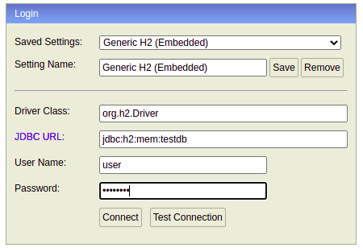

## Test task by UzKassa

- Postman collection can be found at root directory of project.
  - `uzkassa-test.postman_collection.json`
- You can access API docs based on the OpenAPI 3 specification at [Swagger UI](http://localhost:8183/swagger-ui.html)

Running with Docker
-------------------------
Need to do following steps:
1. Run `./build-images.sh` - to build images from Dockerfile.
2. Run `docker-compose up --build --force-recreate`
* Application uses PostgreSql database on docker machine.
------------------

Running without Docker
-------------------------
Need to do following steps:
--------------------
1. Run ` ./mvnw spring-boot:run -Dspring-boot.run.profiles=local`
   
* Application uses H2 database ( in-memory database) on non-docker machine.
   You can access its console at [H2 Console](http://localhost:8183/h2)
------------------
* 